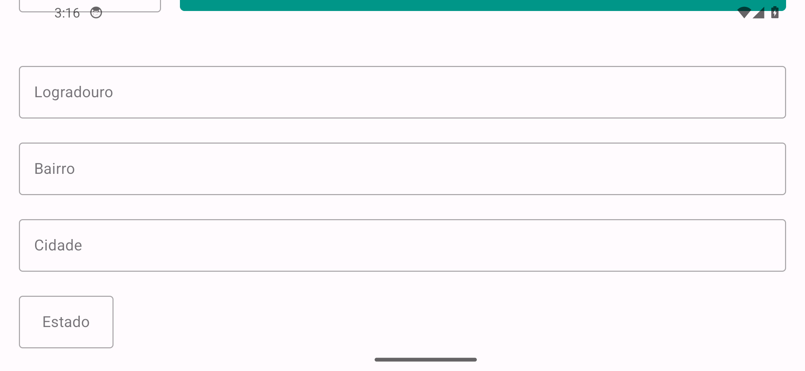

# 📍 Consumindo API

App Android que consulta endereços a partir do CEP, consumindo uma API REST com Retrofit.

## Como rodar

1. Abra o projeto no **Android Studio**
2. Aguarde a sincronização do Gradle
3. Rode em um emulador ou em um celular com depuração USB ativada

---

Feito por [Kayan Denizo](https://github.com/KayanDenizo).
